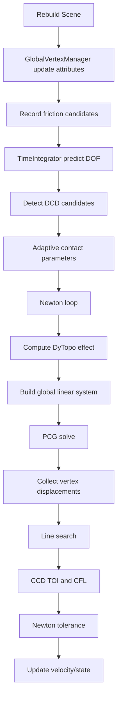

# CoreX/NVIDIA Full-Chain Compatibility Difference Audit 2026-05-05

## Method

This audit was performed from directory inventory and direct file reading. I did not use grep, rg, find, or keyword search to discover risk points. The conclusions below are based on reading the CoreX `UIPC_COREX_CUDA10_COMPAT` implementations and the corresponding NVIDIA/upstream `#else` implementations in the simulation chain.

No code was changed, no benchmark was run, and no bundle was generated in this audit round.

## Simulation Chain Map

For the current IPC/wrecking-ball path, the relevant per-frame flow is:

The hottest repeated stages are contact detection/filtering, DyTopo assembly/conversion, global linear-system assembly, PCG solve, and line-search energy/filtering.

## Files Read

### Orchestration

- `src/backends/cuda/engine/sim_engine.cu`
- `src/backends/cuda/engine/sim_engine_do_advance.cu`
- `src/backends/cuda/engine/advance_ipc.cu`
- `src/backends/cuda/engine/advance_al.cu`
- `src/backends/cuda/line_search/line_searcher.cu`
- `src/backends/cuda/line_search/line_search_reporter.cu`

### Collision And Contact

- `src/backends/cuda/collision_detection/global_trajectory_filter.cu`
- `src/backends/cuda/collision_detection/filters/stackless_bvh_simplex_trajectory_filter.cu`
- `src/backends/cuda/contact_system/global_contact_manager.cu`
- `src/backends/cuda/contact_system/contact_models/ipc_simplex_normal_contact.cu`

Related files in the same module were inventoried and classified as wrappers, alternate filter variants, exporters, or AL-only paths unless they feed the current IPC/wrecking-ball path.

### DyTopo And Matrix Conversion

- `src/backends/cuda/dytopo_effect_system/global_dytopo_effect_manager.cu`
- `src/backends/cuda/dytopo_effect_system/dytopo_effect_reporter.cu`
- `src/backends/cuda/dytopo_effect_system/dytopo_effect_receiver.cu`
- `src/backends/cuda/algorithm/details/matrix_converter.inl`

### ABD Pipeline

- `src/backends/cuda/affine_body/abd_linear_subsystem.cu`
- `src/backends/cuda/affine_body/affine_body_dynamics.cu`
- `src/backends/cuda/affine_body/affine_body_vertex_reporter.cu`
- `src/backends/cuda/affine_body/affine_body_body_reporter.cu`
- `src/backends/cuda/affine_body/bdf/affine_body_bdf1_kinetic.cu`
- `src/backends/cuda/affine_body/abd_diag_preconditioner.cu`
- `src/backends/cuda/affine_body/abd_tolerance_checker.cu`
- `src/backends/cuda/affine_body/abd_line_search_reporter.cu`
- `src/backends/cuda/affine_body/abd_dytopo_effect_receiver.cu`
- `src/backends/cuda/affine_body/abd_time_integrator.cu`

### Linear System And PCG

- `src/backends/cuda/linear_system/global_linear_system.cu`
- `src/backends/cuda/linear_system/spmv.cu`
- `src/backends/cuda/linear_system/linear_pcg_corex.cu.inc`
- `src/backends/cuda/affine_body/abd_diag_preconditioner.cu`

### FEM And Shared Geometry

- `src/backends/cuda/finite_element/finite_element_method.cu`
- `src/backends/cuda/finite_element/fem_linear_subsystem.cu`
- `src/backends/cuda/finite_element/fem_diag_preconditioner.cu`
- `src/backends/cuda/finite_element/matrix_utils.cu`
- `src/backends/cuda/finite_element/mas_preconditioner_engine_corex.cu`
- `src/backends/cuda/global_geometry/global_vertex_manager.cu`

## Module Findings

### Engine And Line Search

`advance_ipc.cu` is the canonical hot path. It does not contain a CoreX/NVIDIA split itself, but it determines frequency: contact detection/filtering and DyTopo happen per Newton; PCG happens per Newton; line-search energy can happen multiple times per Newton.

`sim_engine.cu` has CoreX-specific constructor probes and an optional direct `<<<1,1>>>` hello kernel. This is init-only and not a runtime bottleneck. Dump helpers copy full surface data to host, but are debug/dump-only.

`line_searcher.cu` is effectively identical in CoreX and NVIDIA. The performance risk is delegated to reporters, especially ABD energy reduction in `abd_line_search_reporter.cu`.

Risk: low in orchestration itself; high only through called modules.

### Collision Detection And Contact Filtering

`global_trajectory_filter.cu` is structurally similar across paths except CoreX adds phase profiling and an opt-in device minimum for TOI. The default non-runtime-check CoreX path still copies the per-filter `tois` array to host and uses CPU `min_element`. Because the number of filters is small, this is not a primary hotspot, but it is a repeated line-search boundary and a clean host round-trip.

`stackless_bvh_simplex_trajectory_filter.cu` uses explicit CoreX kernels for AABB construction, TOI kernels, and active-contact filters. These are parallel and not DyTopo-style serial. The major cost here is algorithmic volume: candidate generation, active selection, and `select_valid_all`. The CoreX path has useful diagnostics and optional early-active filtering, but historical tests showed that reducing selected contacts can hurt convergence. Treat this module as high wall-time but not obviously an implementation mismatch win.

`global_contact_manager.cu` replaces NVIDIA `ParallelFor` CFL norm computation with an explicit kernel. This is API-only divergence with equivalent parallelism. Contact tabular construction is host-side/init-only.

`ipc_simplex_normal_contact.cu` replaces complex `Launch().apply` lambdas with explicit kernels for PP/PE/EE/PT energy and gradient/Hessian. This is parallel and necessary for CoreX correctness. Diagnostics such as SPD stats, PE diag regularization, PE kappa scaling, and host sums are env-gated and should remain opt-in. The default path is not serial, but CoreX float precision plus SPD projection is still a numerical-conditioning risk rather than a kernel-shape risk.

Risk ranking in this module:

- High wall-time but medium optimization certainty: active contact selection and contact detect/filter detail.
- Medium: default TOI host min, repeated but small.
- Low: contact model explicit kernels, because parallelism is equivalent.

### DyTopo And Matrix Conversion

`global_dytopo_effect_manager.cu` does three phases: assemble reporter outputs, convert collected triplets/doublets, and distribute classified effects. The previously severe ABD DyTopo receiver issue was in ABD distribution, not the manager itself, and has already been fixed by defaulting explicit parallel kernels in `abd_linear_subsystem.cu`.

The remaining high-risk section is CoreX matrix conversion:

- CoreX `matrix_converter.inl` routes through explicit helper kernels in `global_dytopo_effect_manager.cu`.
- NVIDIA uses `ParallelFor`, `DeviceRunLengthEncode`, `DeviceScan`, and `FastSegmentalReduce`.
- CoreX uses hash/decode/copy helper kernels plus `DeviceRadixSort`, `DeviceRunLengthEncode`, and then custom linear atomic segment reducers.
- `corex_matconv_sync_if_needed()` synchronizes after many substeps unless `UIPC_COREX_MATCONV_ASYNC` is set.
- `launch_segmental_reduce_3x3` and `launch_segmental_reduce_3x1` zero the output, optionally synchronize, then run one input entry per thread with atomic adds into segment outputs.

This is a high-risk algorithmic mismatch because it is per Newton, scales with DyTopo/contact triplets, and remains visible after DyTopo parallelization. Short tests showed `UIPC_COREX_MATCONV_ASYNC=1` can help `wb150`, but it did not pass the previous `wb400` defaulting bar. A better next candidate is not simply default async; it is a block-level segment reduction kernel that reduces atomic contention while keeping CoreX-safe explicit kernels.

Risk: high.

### ABD Pipeline

`abd_linear_subsystem.cu` is the main ABD assembly path. It has CoreX explicit kernels for kinetic/shape gradient and Hessian assembly. These generally preserve NVIDIA parallelism. The old serial DyTopo gradient/hessian kernels are still present as rollback (`UIPC_COREX_ABD_DYTOPO_SERIAL=1`), but default now uses parallel kernels and is no longer a hotspot.

Remaining risks:

- `corex_abd_assemble_sync_if_requested()` defaults to synchronizing unless `UIPC_COREX_ABD_ASSEMBLE_ASYNC` is set. This occurs after key ABD assembly kernels. Earlier data suggests removing syncs can be mixed, so it should stay opt-in unless a combined long gate wins.
- Reporter gradient/hessian assembly in the CoreX branch still uses `ParallelFor` in places. That is not automatically unsafe, but it should be watched because CoreX comments elsewhere describe device lambda failures. In read context, these reporter paths are smaller than DyTopo/contact.
- `affine_body_dynamics.cu` uses raw `cudaMalloc`/`cudaMemcpy` and multiple synchronizations during geometry upload. This is init-time and not a per-frame hotspot.
- `affine_body_vertex_reporter.cu` defaults to host fallback for `init_attributes` and `update_attributes` unless `UIPC_COREX_ABD_VERTEX_GPU` is set. This is per frame through `GlobalVertexManager::update_attributes`, so it is a real compatibility regression. Previous short A/B was only a small win, but it remains structurally suspicious.
- `affine_body_body_reporter.cu` defaults to host iota unless `UIPC_COREX_ABD_BODY_IOTA_GPU` is set. It is init/report-time and small.
- `affine_body_bdf1_kinetic.cu` defaults to host fallback for energy and gradient/Hessian unless GPU env flags are set. This is potentially important because kinetic energy participates in line search and kinetic gradient/Hessian participates in assembly. Previous combined opt-in did not cleanly win, but the module is still a high-quality target for isolated testing.
- `abd_tolerance_checker.cu` defaults to copying all `dq` to host unless `UIPC_COREX_ABD_TOLERANCE_GPU` is set. This is per Newton. It is simpler than BDF1 and likely safe to default only after isolated A/B.
- `abd_line_search_reporter.cu` defaults energy summation to host unless GPU reduction env flags are set. Since line search can repeat per Newton, this is another host-boundary risk.
- `abd_diag_preconditioner.cu` applies/assembles via explicit kernels, then synchronizes unless skip envs are set. Because preconditioner apply is per PCG iteration, this sync deserves attention, but previous experiments around PCG sync were not a stable long-run default.

Risk ranking in ABD:

- High: BDF1 kinetic host fallback, ABD vertex update host fallback, ABD line-search energy host sum.
- Medium: ABD tolerance host fallback.
- Medium: preconditioner sync boundaries.
- Low: geometry upload raw copies, because init-only.

### Linear System, SpMV, And PCG

`global_linear_system.cu` now defaults to device GE-to-symmetric conversion, with host conversion only under `UIPC_COREX_FORCE_HOST_GE2SYM`. Assembly phase profiling shows diag subsystem and DyTopo/contact effects dominate before conversion. The file itself is not the worst mismatch after device conversion.

`spmv.cu` is a serious algorithmic divergence:

- CoreX forces `UIPC_SPMV_ILUVATAR_RBK_WORKAROUND`.
- The NVIDIA path uses warp segmented reduction with CUB `HeadSegmentedReduce` and shuffle primitives.
- CoreX default `sym_spmv` uses triplet-parallel atomics, while the `UIPC_COREX_SPMV_ROW_SCAN` fallback is even worse: one block-row thread scans all triplets.
- `UIPC_COREX_SPMV_GROUPED_ROW` is an attempted explicit grouped-row candidate that keeps off-diagonal atomics and scans rows for diagonal contributions. Previous A/B did not pass.

The key point is that SpMV remains high-risk, but the simple grouped-row version is not good enough. The next viable candidate would need a true CoreX-safe segmented reduction that avoids problematic CUB primitives without falling back to heavy atomics or row scans.

`linear_pcg_corex.cu.inc` is the other high-risk PCG file:

- CoreX dot/norm uses custom reductions ending in `cudaDeviceSynchronize()` and host scalar reads.
- `pAp` dot and `r.z/norm` happen every iteration.
- `spmv` is followed by an explicit `cudaDeviceSynchronize()` unless `UIPC_COREX_PCG_SKIP_SPMV_SYNC` is set.
- `UIPC_COREX_PCG_REDUCE2` reduces atomic pressure but did not pass the previous long gate as a default.

The PCG risk is not one single bad kernel but repeated scalar boundaries multiplied by high iteration counts. This makes it a top optimization area, but changes are numerically risky and must be validated with `wb400`.

Risk: high.

### FEM And Shared Utilities

Current `wrecking_ball` is primarily ABD/contact. FEM files are important for generality but lower priority for this scene unless mixed ABD/FEM scenes are targeted.

`finite_element_method.cu` CoreX has a whole-file switch mainly for feature compatibility. It performs significant host-side build/classification at init. Not a current `wrecking_ball` runtime hotspot.

`fem_linear_subsystem.cu` uses `ParallelFor` and standard assembly patterns. It does not show the same obvious CoreX serial fallback in the read sections.

`fem_diag_preconditioner.cu` is parallel and similar in shape to NVIDIA.

`matrix_utils.cu` replaces generic Eigen helpers with CoreX-compatible explicit copy/EVD/SPD helpers. This is numerical/codegen compatibility, not obviously a performance hotspot in current ABD scene.

`mas_preconditioner_engine_corex.cu` is a large GPU-parallel MAS engine. It has host reads for level sizes during hierarchy build, but FEM MAS is not the current `wrecking_ball` path.

`global_vertex_manager.cu` is relevant to all scenes. It contains CoreX explicit kernels for step-forward and CCD setup, which are healthy. It also uses host-vector initialization because `BufferLaunch().fill()` was unreliable on CoreX; that is init-only. Bounding-box host fallback is env-gated.

Risk: low for current `wrecking_ball`, medium for broader FEM workloads.

## High-Risk Candidate Ranking

### 1. Matrix converter segment reduction

Files:

- `src/backends/cuda/algorithm/details/matrix_converter.inl`
- `src/backends/cuda/dytopo_effect_system/global_dytopo_effect_manager.cu`

Why high risk:

- Default hot path after DyTopo parallelization.
- Algorithmic mismatch with NVIDIA `FastSegmentalReduce`.
- Current CoreX implementation uses linear atomic segment reduction.
- Scales with contact/DyTopo triplets per Newton.

Recommended candidate:

- Implement a CoreX explicit block-level segment reducer for 3x3 and 3x1 blocks.
- Keep `UIPC_COREX_MATCONV_ASYNC` as separate opt-in.
- Compare against default and async-only.

### 2. CoreX-safe segmented SpMV

File:

- `src/backends/cuda/linear_system/spmv.cu`

Why high risk:

- Runs every PCG iteration.
- NVIDIA uses segmented warp reduction; CoreX uses workaround paths.
- PCG iteration count remains high, so per-iteration cost matters.

Recommended candidate:

- Do not reuse the previous grouped-row implementation as a default.
- Design a segmented reduction using explicit kernels and shared memory/block-level row grouping, avoiding CUB shuffle primitives.
- Validate first on `wb80/wb150` with PCG cost diagnostics.

### 3. PCG scalar boundary reduction

File:

- `src/backends/cuda/linear_system/linear_pcg_corex.cu.inc`

Why high risk:

- `dot/norm` and `pAp` scalar reads happen every iteration.
- `cudaDeviceSynchronize()` appears in the custom reduction path.
- `dotnorm` remains a large PCG bucket.

Recommended candidate:

- Avoid changing convergence semantics.
- Try to combine unavoidable scalar reads into fewer sync points, or make pAp and rz/norm reductions share one reduction/finalization path per iteration.
- Keep `UIPC_COREX_PCG_REDUCE2` opt-in until a `wb400` win is shown.

### 4. ABD host fallback cleanup

Files:

- `src/backends/cuda/affine_body/affine_body_vertex_reporter.cu`
- `src/backends/cuda/affine_body/bdf/affine_body_bdf1_kinetic.cu`
- `src/backends/cuda/affine_body/abd_line_search_reporter.cu`
- `src/backends/cuda/affine_body/abd_tolerance_checker.cu`

Why medium-high risk:

- Several default host round-trips remain.
- Frequencies range from per frame to per Newton and line-search iteration.
- Previous combined opt-in gave only small/noisy gains, but isolated defaults might still be worthwhile.

Recommended candidate:

- Test each fallback independently, not as one combined env bundle.
- Default only if `wb150` and `wb400` both improve.

### 5. Contact detect/filter selected-set construction

Files:

- `src/backends/cuda/collision_detection/filters/stackless_bvh_simplex_trajectory_filter.cu`

Why medium risk:

- It is a major wall-time bucket after DyTopo parallelization.
- It is already GPU-parallel, so gains require algorithmic changes rather than simply restoring NVIDIA shape.
- Prior early-filter experiments hurt convergence.

Recommended candidate:

- Keep as second-line unless matrix converter/PCG work stalls.
- Any pruning must preserve selected-set equivalence.

## Directions Not Recommended As Immediate Defaults

- PE Hessian diagonal regularization or kappa scaling: already failed short gates or long gates.
- SpMV grouped-row atomic path: not a clean `wb150` win.
- PCG `SKIP_SPMV_SYNC`: can be faster but increased risk and did not prove stable enough for default.
- Blanket defaulting of ABD GPU fallback envs: combined result was small and noisy.
- FEM MAS/FEM constitutions for current `wrecking_ball`: not the primary hot path.

## Next Implementation Recommendation

The next implementation round should focus on one of these two concrete candidates:

1. CoreX block-level matrix converter segment reduction.
2. CoreX-safe segmented SpMV.

The matrix converter candidate is the better first choice because:

- It is now visible after DyTopo parallelization.
- It has a narrower behavioral surface than PCG convergence logic.
- It can be implemented as an opt-in replacement for `launch_segmental_reduce_3x3` and `launch_segmental_reduce_3x1`.
- It avoids directly changing solver numerics.

Validation should use:

- Build.
- `simple90/simple300/stack120`.
- `wb80/wb150` with phase profile.
- `wb400` only if `wb150` improves wall time and PCG/Newton counts do not regress.
